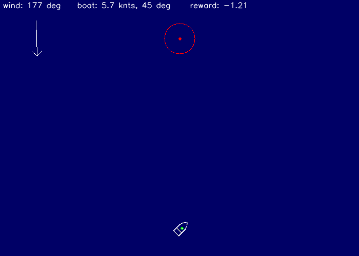
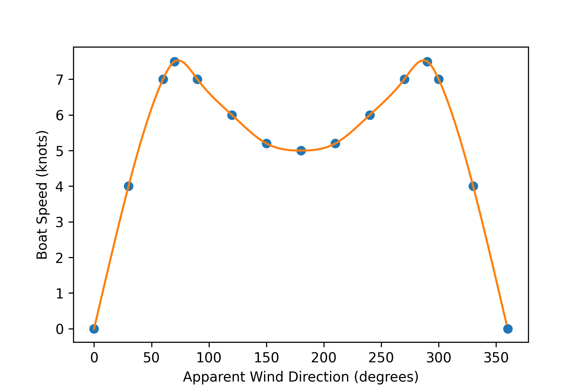

# Sailing Upwind with Reinforcement Learning

The objective of the agent is to steer the sailboat towards the target in the shortest amount of time. Built with Stable Baselines 3 and OpenAI Gym.

 The environment is defined in `sailing.py`.

Speed of the boat depends on its angle relative to the wind direction (0 wind direction means the boat is facing the wind):

The reward function is defined as follows:

`reward = ((250 - euclidean_dist_to_target) + target_reward - 2*time_elapsed)/100`

- `euclidean_dist_to_target` is the distance between the agent and the target
- `target_reward` = `10000` if the boat is near the target (red circle)
- `time_elapsed` is the number of steps since the start of the episode

## Setup

`$ pip install -r requirements.txt`

## Usage

To run the pretrained model, simply execute this command:

`$ python3 test_model.py`

